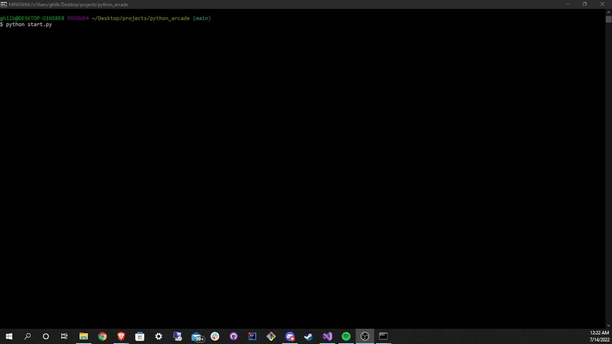
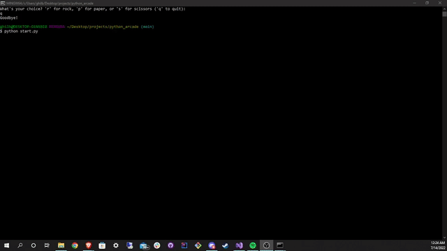
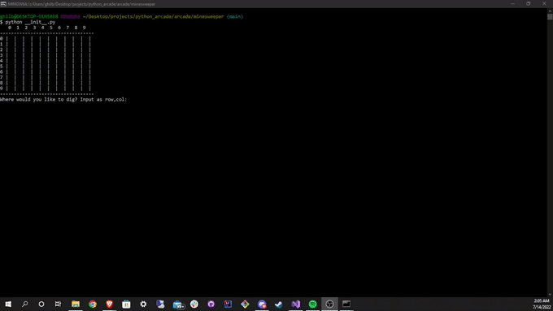

# Python Archade

## Table of Contents
* [Description](#Description)
* [Installation](#Installation)
* [Usage](#Usage)
* [Questions](#Questions)
* [Credits](#Credits)

## Description
Welcome to Python Arcade! A series of algorithm-based python command line games. Begin the program by running `python start.py` and select the game you would like to play. The current games offered are Hangman, Rock Paper Scissors, Tic Tac Toe, and Minesweeper, with more to come. 

## Usage
Here is a demonstration of how to use this app:

### Hangman

        

### Rock, Paper, Scissors!

        

### Tic Tac Toe

        

### Minesweeper

        

## Installation
To use this application clone this repository to your machine and in the root folder, run `python start.py` to access the arcade.

## Questions
If you have any questions about this project, please contact me via my GitHub: https://github.com/garretthilberling

## Credits
This project was created solely by Garrett Hilberling: https://www.linkedin.com/in/garretthilberling/
